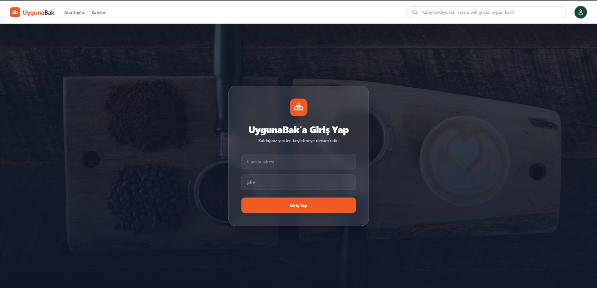
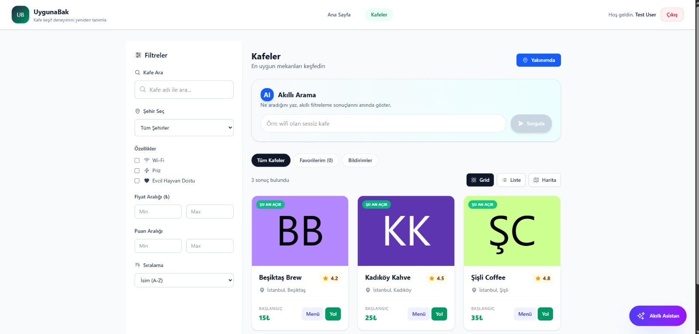
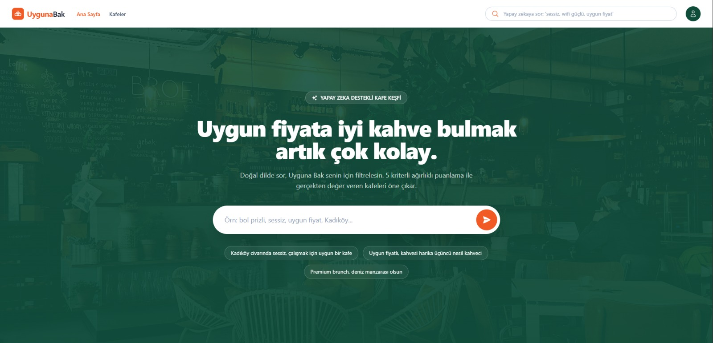
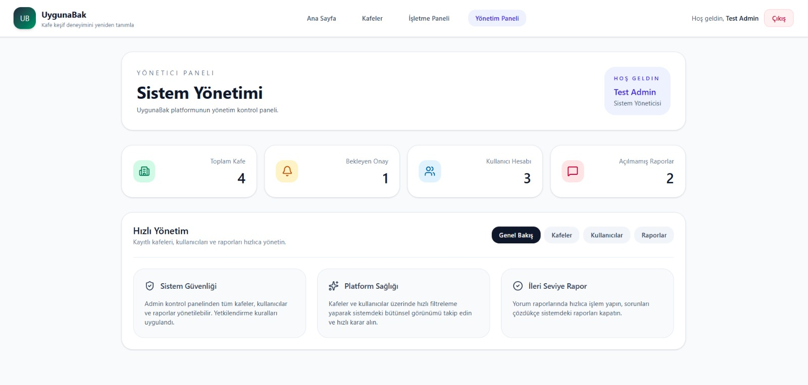
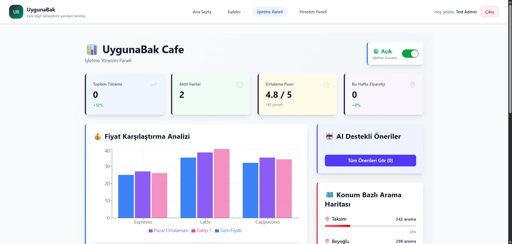

# UygunaBak - Akıllı Kafe Bulma ve Yönetim Platformu

## 📋 Proje Açıklaması

**UygunaBak**, kullanıcıların yakınlarındaki kafeleri keşfetmesine, incelemesine ve karşılaştırmasına yardımcı olan modern bir web uygulamasıdır. Proje, müşterilerin kafe deneyimini geliştirmek ve işletme sahiplerine kendi işletmelerini yönetme araçları sağlamak için tasarlanmıştır.

## 🎯 Projenin Amacı

- **Kullanıcılar için**: Yakın çevredeki kafeler hakkında akıllı filtreleme, harita entegrasyonu ve AI destekli arama ile kolay bir şekilde bilgi edinebilme
- **İşletme Sahipleri için**: Kendi kafelerini yönetme, ürün ve fiyat güncelleme, müşteri yorumlarına yanıt verme
- **Yöneticiler için**: Sistem genelinde raporlama, kafe onayı ve veri yönetimi

## 🛠 Kullanılan Teknolojiler

### Backend
- **Node.js** - JavaScript runtime
- **Express.js** - REST API framework
- **PostgreSQL** - İlişkisel veritabanı
- **JWT** - Kimlik doğrulama ve yetkilendirme
- **CORS** - Cross-Origin Resource Sharing
- **bcryptjs** - Parola şifreleme
- **dotenv** - Ortam değişkenleri yönetimi

### Frontend
- **React.js** - UI kütüphanesi
- **React Router** - Sayfa yönlendirmesi
- **Tailwind CSS** - Stil ve tasarım
- **Axios** - HTTP istemcisi
- **Heroicons** - İkon kütüphanesi
- **Vite** - Build tool ve geliştirme sunucusu

### Database
- **PostgreSQL 12+** - Ana veritabanı
- SQL şemaları ve seed verisi

## 📦 Kurulum Adımları

### Ön Koşullar
- Node.js v16 veya üstü
- PostgreSQL 12 veya üstü
- npm veya yarn paket yöneticisi
- Git

### 1. Projeyi Klonlayın
```bash
git clone https://github.com/[kullanici-adi]/UygunaBak.git
cd uygunabak
```

### 2. Backend Kurulumu
```bash
cd backend

# Bağımlılıkları yükleyin
npm install

# .env dosyasını oluşturun (örnek şablondan)
cp .env.example .env

# .env dosyasını metin editörü ile açıp gerçek değerleri girin:
# - PGPASSWORD: Veritabanı şifresi
# - JWT_SECRET: Güvenli bir token şifresi (terminal'de: node -e "console.log(require('crypto').randomBytes(32).toString('hex'))")
# - Diğer veritabanı bağlantı bilgileri

# Windows'ta:
# Notepad ile açın: notepad .env
# macOS/Linux'ta:
# nano .env
```

### 3. Veritabanını Kurun
```bash
# PostgreSQL'e bağlanın ve veritabanını oluşturun
createdb uygunabak_db

# Veritabanı şemasını ve örnek verileri yükleyin
psql -U postgres -d uygunabak_db -f ./database.sql
psql -U postgres -d uygunabak_db -f ./sample_data.sql
```

### 4. Frontend Kurulumu
```bash
cd frontend

# Bağımlılıkları yükleyin
npm install

# .env dosyasını oluşturun (varsa)
# VITE_API_BASE_URL=http://localhost:5000/api
```

## 🚀 Çalıştırma Adımları

### Backend Sunucusu Başlatın
```bash
cd backend
npm start

# Başarılı olursa:
# Backend sunucusu http://localhost:5000 portunda çalışıyor 🚀
```

### Frontend Geliştirme Sunucusu Başlatın
```bash
cd frontend
npm run dev

# Başarılı olursa:
# http://localhost:5173 adresinde açılacak
```

## 📸 Ekran Görüntüleri



---



---



---



---



---

## ✨ Ana Özellikler

### 👥 Müşteri Özellikleri
- ✅ Yakın çevredeki kafeler haritada gösterimi
- ✅ Gelişmiş filtreleme (şehir, ilçe, fiyat aralığı, derecelendirme, özellikler)
- ✅ AI destekli akıllı arama
- ✅ Kafe detay sayfası (menü, fiyatlar, özellikler, yönetici yanıtlı yorumlar)
- ✅ Yorum yapma ve derecelendirme sistemi
- ✅ Favori kafeleri kaydetme
- ✅ Kullanıcı hesabı oluşturma ve yönetimi

### 🏪 İşletme Sahibi Özellikleri
- ✅ Kendi kafe bilgilerini yönetme
- ✅ Ürünleri ve fiyatları güncelleme (hızlı güncelleme paneli)
- ✅ Kafe özelliklerini düzenleme (WiFi, Pet Friendly vb.)
- ✅ Müşteri yorumlarına cevap verme
- ✅ Satış kampanyaları oluşturma ve yönetme
- ✅ Performans metriklerini görüntüleme (KPI)

### 👨‍💼 Yönetici Özellikleri
- ✅ Tüm kafeleri yönetme ve onaylama
- ✅ Sistem genelinde raporlama
- ✅ Müşteri geri bildirimlerini görüntüleme
- ✅ Yoğunluk haritası (HeatMap) gösterimi
- ✅ Fiyat karşılaştırma analizi

## 📁 Proje Klasör Yapısı

```
uygunabak/
├── backend/                    # Express.js API sunucusu
│   ├── middleware/             # Kimlik doğrulama ve diğer middleware'ler
│   │   └── auth.js             # JWT doğrulama middleware
│   ├── adminController.js      # Yönetici işlemleri
│   ├── aiSearchController.js   # AI destekli arama
│   ├── authController.js       # Giriş/Kayıt işlemleri
│   ├── cafesController.js      # Kafe listeleme ve filtreleme
│   ├── favoritesController.js  # Favorilere ekleme/çıkarma
│   ├── ownerController.js      # İşletme sahibi işlemleri
│   ├── reviewsController.js    # Yorum yönetimi
│   ├── dbInit.js               # Veritabanı başlatma
│   ├── server.js               # Ana sunucu dosyası
│   ├── package.json            # Backend bağımlılıkları
│   └── .env                    # Ortam değişkenleri (ignored)
│
├── frontend/                   # React.js UI uygulaması
│   ├── src/
│   │   ├── components/         # Yeniden kullanılabilir bileşenler
│   │   │   ├── AiSearchBox.jsx
│   │   │   ├── CafeCard.jsx
│   │   │   ├── CafeMap.jsx
│   │   │   ├── FilterPanel.jsx
│   │   │   ├── LocationSelector.jsx
│   │   │   ├── OwnerDashboard.jsx
│   │   │   ├── ReviewList.jsx
│   │   │   ├── Toast.jsx
│   │   │   └── dashboard/      # Dashboard bileşenleri
│   │   ├── pages/              # Sayfa bileşenleri
│   │   │   ├── Home.jsx
│   │   │   ├── admin/
│   │   │   │   └── AdminDashboard.jsx
│   │   │   └── auth/
│   │   │       └── Login.jsx
│   │   ├── App.jsx             # Ana uygulama bileşeni
│   │   ├── CafeList.jsx        # Kafe listesi bileşeni
│   │   ├── main.jsx            # React uygulamasının entry point
│   │   ├── App.css             # Global stil dosyası
│   │   └── index.css           # Tailwind CSS imports
│   ├── public/                 # Statik dosyalar
│   ├── package.json            # Frontend bağımlılıkları
│   ├── vite.config.js          # Vite yapılandırması
│   ├── tailwind.config.js      # Tailwind CSS yapılandırması
│   ├── postcss.config.js       # PostCSS yapılandırması
│   └── index.html              # HTML giriş dosyası
│
├── images/                     # Uygulama ekran görüntüleri
├── database.sql                # Ana veritabanı şeması
├── sample_data.sql             # Örnek veriler
├── seed_feature_variety.sql    # Özellik seed verisi
├── pet_friendly.sql            # Pet-friendly kafeler
├── rich_cafes_and_menus.sql    # Zengin menüler
├── more_cities.sql             # Daha fazla şehir verisi
├── package.json                    # Root proje konfigürasyonu
└── .gitignore                      # Git ignore rules
```

## 🔧 API Endpoints

### Kafe Endpoints
- `GET /api/cafes` - Kafeleri listele ve filtrele
- `GET /api/cafes/:id` - Kafe detaylarını al

### Yorum Endpoints
- `POST /api/reviews` - Yorum ekle/güncelle
- `GET /api/reviews/:cafe_id` - Kafeye ait yorumları getir
- `POST /api/reviews/:id/reply` - Yoruma yanıt ver (işletme sahibi)

### Kullanıcı Endpoints
- `POST /api/auth/register` - Kayıt ol
- `POST /api/auth/login` - Giriş yap
- `GET /api/auth/me` - Mevcut kullanıcı bilgisi

### Favoriler Endpoints
- `POST /api/favorites` - Favoriye ekle
- `GET /api/favorites` - Favorileri getir
- `DELETE /api/favorites/:cafe_id` - Favoridan çıkar

### İşletme Sahibi Endpoints
- `GET /api/owner/dashboard` - Dashboard verisi
- `PUT /api/owner/cafes/:id` - Kafe bilgilerini güncelle
- `POST /api/owner/products` - Ürün ekle/güncelle

### Yönetici Endpoints
- `GET /api/admin/cafes` - Tüm kafeleri getir
- `PUT /api/admin/cafes/:id/approve` - Kafe onayı
- `GET /api/admin/analytics` - Sistem analitiği

## � Güvenlik

### Hassas Bilgileri Koruma

Bu proje **Veritabanı şifrelerini**, **API anahtarlarını** ve diğer gizli bilgileri `.gitignore` dosyası ile korur:

- ✅ `.env` dosyası GitHub'a yüklenmez
- ✅ JWT token şifresi ortam değişkeninden okunur
- ✅ Veritabanı şifresi kod içinde hardcoded değildir

### Kurulum Sırasında

```bash
# 1. Backend'de .env dosyası oluşturun
cd backend
cp .env.example .env

# 2. .env dosyasını düzenleyin ve gerçek değerleri girin:
# PGPASSWORD=your_secure_password
# JWT_SECRET=your_secure_jwt_key
```

### Güvenli JWT Key Oluşturmak

```bash
# Terminalde çalıştırın:
node -e "console.log(require('crypto').randomBytes(32).toString('hex'))"

# Çıktıyı .env dosyasına JWT_SECRET olarak yapıştırın
```

**Detaylı bilgi için [SECURITY.md](./SECURITY.md) dosyasını okuyun.**

## �🚨 Bilinen Sorunlar ve İyileştirmeler

### Güncel Sorunlar (İyileştirme için planlanan)
- [ ] Fiyat güncellemesinden sonra gerçek zamanlı güncelleme (WebSocket ile iyileştirilecek)
- [ ] Bazı sayfalarda yorum görüntüleme performansı (pagination eklenecek)
- [ ] Harita yüklenme süresi (veri optimizasyonu yapılacak)

### Planlanan Geliştirmeler
- [ ] Gerçek zamanlı bildirim sistemi
- [ ] Geliştirilmiş arama algoritması
- [ ] Mobil uygulama (React Native)
- [ ] Sosyal medya entegrasyonu
- [ ] İşletme sahibi cep telefonu uygulaması
- [ ] Gelişmiş analitik dashboard

## 💡 Geliştirme Önerileri

1. **Performans Optimizasyonu**
   - Veritabanı sorgularına indeks ekleyin
   - Frontend komponentlerini React.memo ile memoize edin
   - Image optimization ve lazy loading uygulayın

2. **Kod Kalitesi**
   - Unit test yoğunluğunu artırın
   - Jest ve React Testing Library kullanın
   - ESLint ve Prettier ile kod formatı kontrol edin

3. **Güvenlik**
   - HTTPS kullanın
   - SQL injection saldırılarına karşı prepared statements kontrol edin
   - CORS politikasını daha kısıtlayıcı yapın
   - Rate limiting ekleyin

4. **Kullanıcı Deneyimi**
   - Karanlık mod desteği ekleyin
   - Çok dilli destek (i18n) ekleyin
   - Erişilebilirlik (a11y) standartlarını uygulayın
   - Responsive tasarımı geliştirebilirsiniz

5. **DevOps**
   - Docker container'ları oluşturun
   - CI/CD pipeline (GitHub Actions) kurabilirsiniz
   - Staging ve production ortamlarını ayırın

## 🤝 Katkıda Bulunan Kişi(ler)

- Sudenaz Gündoğdu
- Beyza Bayrak
- Sılanur Yurtyapan
- Tuana Pişken
- Ahmet Erim


## 📄 Lisans

Bu proje [MIT Lisansı](LICENSE) altında yayınlanmıştır.

## 📧 İletişim

Sorularınız veya önerileriniz için lütfen bir issue açınız veya [sudegundogdu5460@gmail.com] adresinden iletişime geçiniz.

## 🙏 Teşekkürler

Bu projeyi geliştirmemize yardımcı olan tüm insanlara ve kaynakların yazarlarına teşekkür ederiz.

---

**Son Güncelleme**: 2026-06-04
**Sürüm**: 1.0.0
